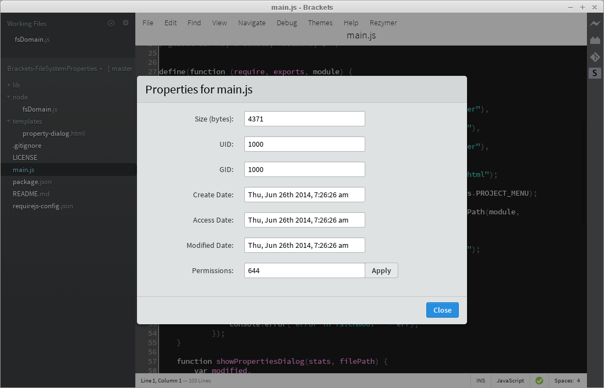

Brackets-FileSystemProperties
=============================

Enables viewing/editing of file/folder properties in the Brackets project tree

I initially wrote this extension to address [Brackets issue #7729](https://github.com/adobe/brackets/issues/7729)

Usage
=====
After installing the extension, you can bring up properties for either a file or directory by right-clicking on an item in the Project Tree (does not apply to Working Set items) and selecting "Properties".  All fields are read-only except "Permissions".

Set Permissions on Files/Directories
====================================
In the edit box for Permissions, enter the new octal value for the file or directory, i.e. to make a file globally writable, enter 666.

**NOTICE on Windows**
Due to the joys of Windows, in that it's not based on POSIX, there are limitations in how you can set file permissions that affect this extension.

Basically you can:
* set a file to writable using *only* `666`
* set a file to read-only using *only* `444`
* other values appear to be *ignored*
* you probably don't even want to mess with folders/directories ;)

More information can be found at the [NodeJS repo issues list](https://github.com/joyent/node/issues/4812)

